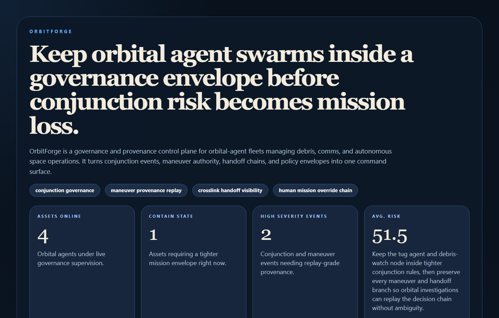
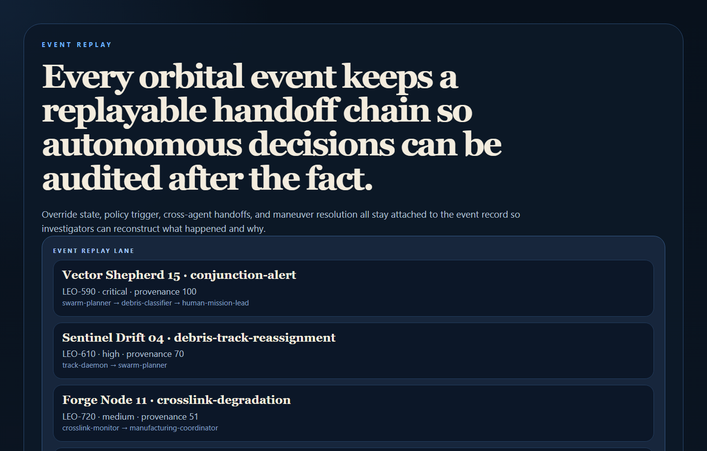
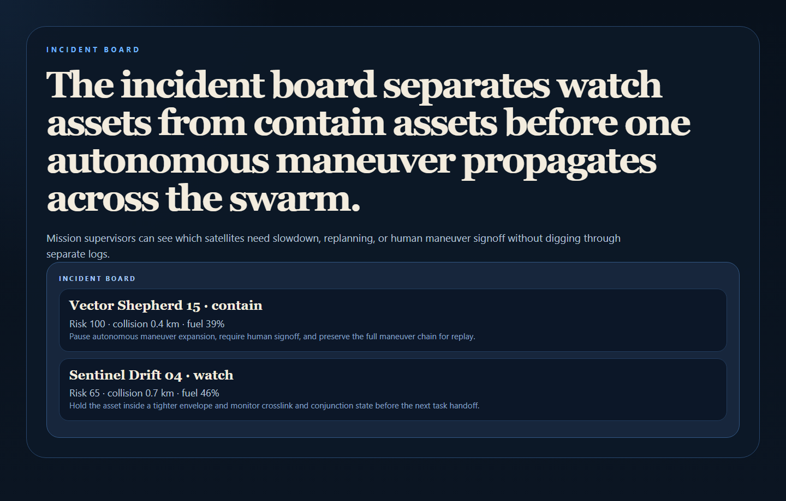
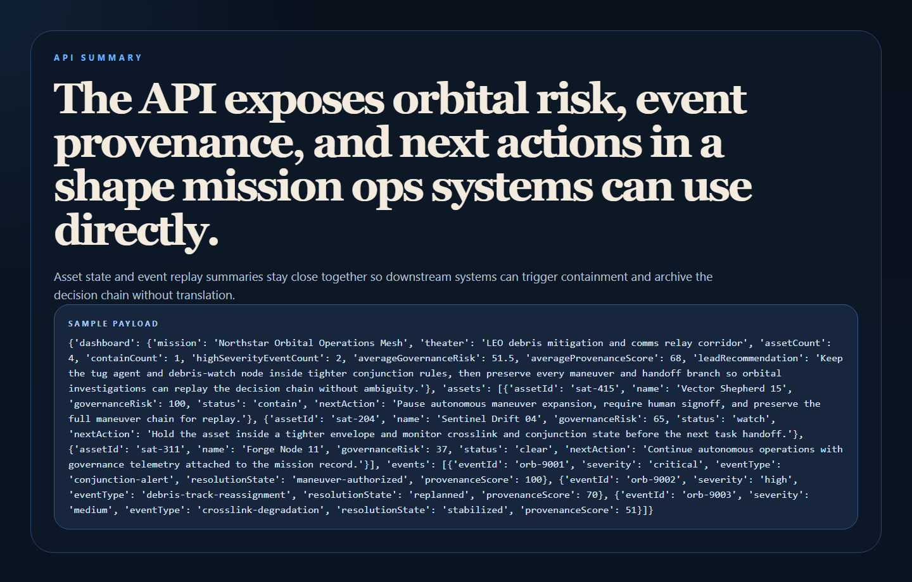

# OrbitForge

OrbitForge is a governance and provenance control plane for satellite and orbital-agent swarms managing debris, comms, and autonomous space operations.



## Why this repo is good

- It tackles a very real future problem: autonomous orbital systems need governance, replayable provenance, and maneuver accountability.
- It keeps the story concrete with conjunction alerts, maneuver authority, crosslink health, and handoff chains.
- It gives you another flagship that feels ambitious but still operationally believable.

## What it does

- Scores orbital assets for governance risk using conjunction distance, fuel margin, crosslink health, override readiness, and event history.
- Tracks orbital events with policy triggers, handoff chains, maneuver authority, and provenance scores.
- Separates clear, watch, and contain states for mission supervision.
- Exposes a clean API plus operator-facing proof surfaces for orbital command, event replay, and incident review.

## Proof





## Local run

```powershell
Set-Location "C:\Users\chaus\dev\repos\orbitforge"
py -3.11 -m venv .venv
.\.venv\Scripts\pip.exe install -r requirements.txt
.\.venv\Scripts\python.exe -m app.main
```

Open:

- `http://127.0.0.1:4846/`
- `http://127.0.0.1:4846/event-replay`
- `http://127.0.0.1:4846/incident-board`
- `http://127.0.0.1:4846/docs`

## Validation

```powershell
.\.venv\Scripts\python.exe -m unittest discover -s tests
.\.venv\Scripts\python.exe scripts\run_demo.py
.\.venv\Scripts\python.exe scripts\smoke_check.py
.\.venv\Scripts\python.exe scripts\render_readme_assets.py
```

## API shape

Endpoints:

- `/api/dashboard/summary`
- `/api/assets`
- `/api/events`
- `/api/assets/{asset_id}`
- `/api/events/{event_id}`
- `/api/sample`

## Repo layout

```text
app/
  data/
  services/
docs/
scripts/
screenshots/
tests/
```
